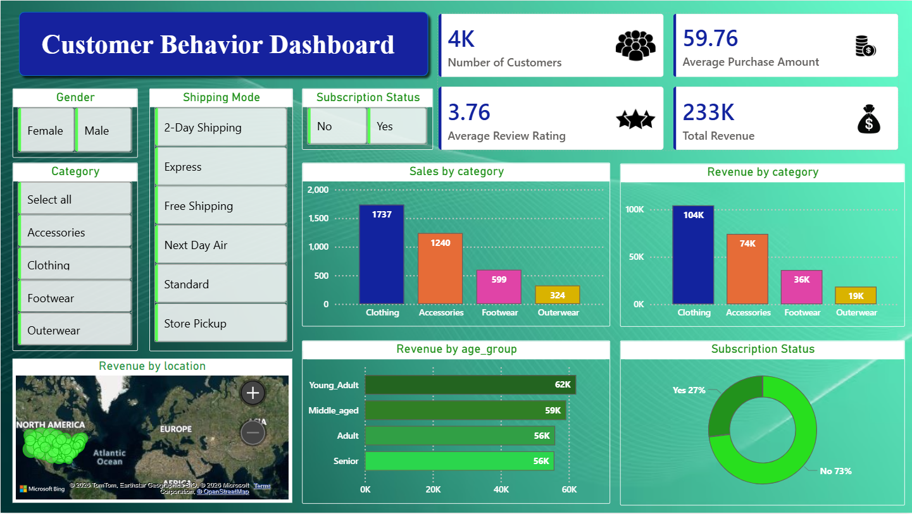

# 📊 Customer Shopping Behavior Analysis

> Analyzed customer shopping behavior to identify revenue drivers, high-value segments, and actionable business insights.

---

## 🔥 Problem

A leading retail company wants to better understand its customers’ shopping behavior in order
to improve sales, customer satisfaction, and long-term loyalty. The management team has
noticed changes in purchasing patterns across demographics, product categories, and sales
channels (online vs. offline). They are particularly interested in uncovering which factors, such
as discounts, reviews, seasons, or payment preferences, drive consumer decisions and repeat
purchases.
You are tasked with analyzing the company’s consumer behavior dataset to answer the
following overarching business question:
“How can the company leverage consumer shopping data to identify trends, improve
customer engagement, and optimize marketing and product strategies?”

---

## 📁 Dataset

* Type: E-commerce customer dataset (simulated)
* Records: ~4,000 customers
* Features:

  * Gender
  * Age Group
  * Product Category
  * Purchase Amount
  * Shipping Mode
  * Subscription Status
  * Customer Ratings

---

## 🛠 Tools Used

* SQL → Data extraction & analysis
* Python (Pandas) → Data cleaning
* Power BI → Dashboard & visualization

---

## ⚙️ Process

1. Cleaned raw data using Python
2. Performed SQL queries to extract insights
3. Built interactive dashboard in Power BI
4. Report Presentation

---

## 📈 Key Insights

* 👕 Clothing generates the highest revenue (104K)
* 📦 Accessories contribute strong secondary revenue (74K)
* 👥 Young Adults are the top revenue-generating segment (62K)
* 📉 Only 27% customers are subscribed → retention opportunity
* 🚚 Shipping preferences impact purchasing behavior

---

## 💡 Business Recommendations

* Focus marketing on **Young Adults**
* Increase revenue via **product bundling (Clothing + Accessories)**
* Improve **subscription conversion strategies**
* Optimize **shipping options for customer convenience**

---

## 📊 Dashboard Preview

---

## 📂 Project Files

- 🐍 Python Notebook: [View File](https://github.com/HackToolsYT/customer_shopping_behavior/raw/main/Customer_Shopping_Behviour_Analysis.ipynb)

- 🗄️ SQL Queries: [View File](https://github.com/HackToolsYT/customer_shopping_behavior/raw/main/customer_analysis.sql)

- 📊 Power BI Dashboard: [Download File](https://github.com/HackToolsYT/customer_shopping_behavior/raw/main/customer_buying_behaviour.pbix)

- 📑 Business Report: [View PDF](https://github.com/HackToolsYT/customer_shopping_behavior/raw/main/Customer%20Shopping%20Behavior%20Analysis.pdf)

- 🖼️ Dashboard Image: [View Image](https://github.com/HackToolsYT/customer_shopping_behavior/raw/main/customer_behavior_dashboard.png)

---

## 🚀 Outcome

This project demonstrates how data analysis can:

* Identify revenue drivers
* Segment customers effectively
* Support business decision-making

---

## 👨‍💻 Author

Vikas Goswami
Data Analyst | SQL | Python | Power BI
